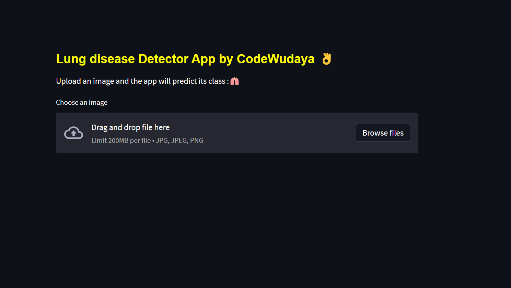
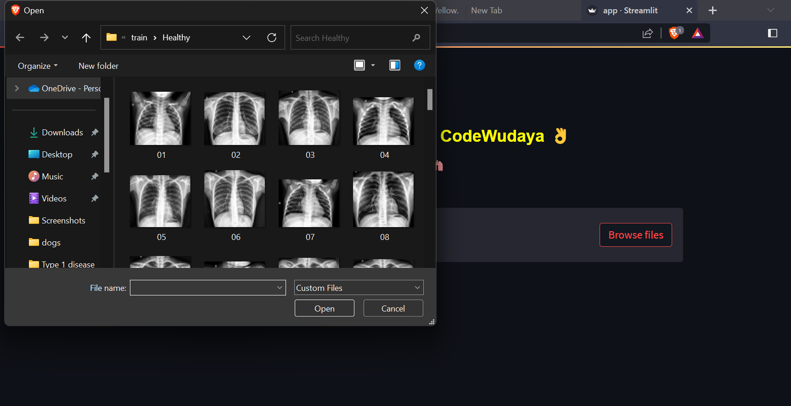

# Lung-Infection-Detection-app
It's a Deep Learning based Lung Infection detector that is deployed in Web in streamlit.
##
Technology used is Convolutional Nural Network ,tensorflow / keras ,python ,streamlit 
##
use command streamlit run app.py after downloading the codes
##

##

##

##
you can directly use it by the GUI code given in .ipnyb file
